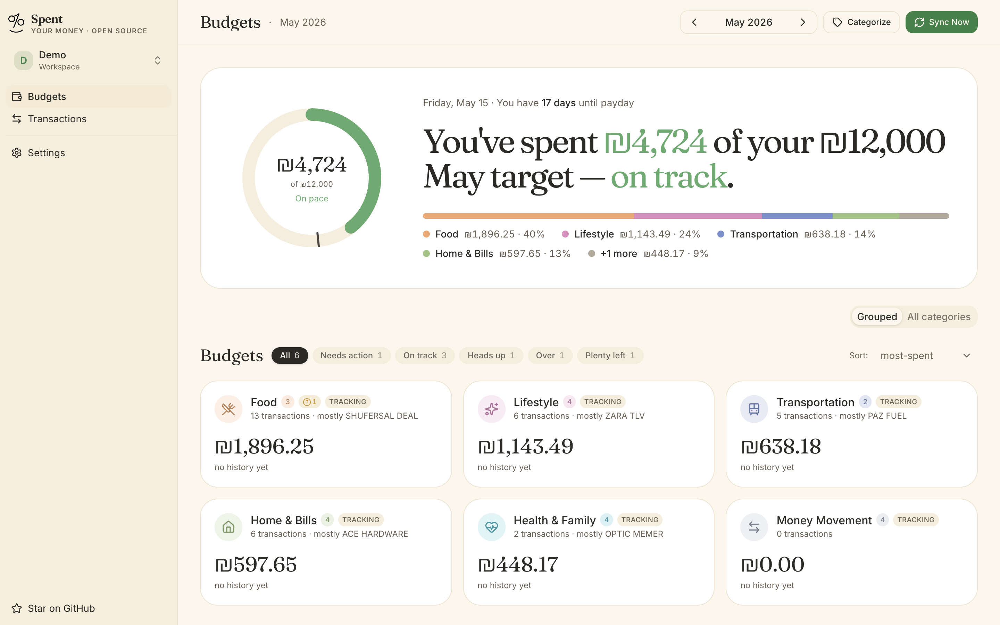
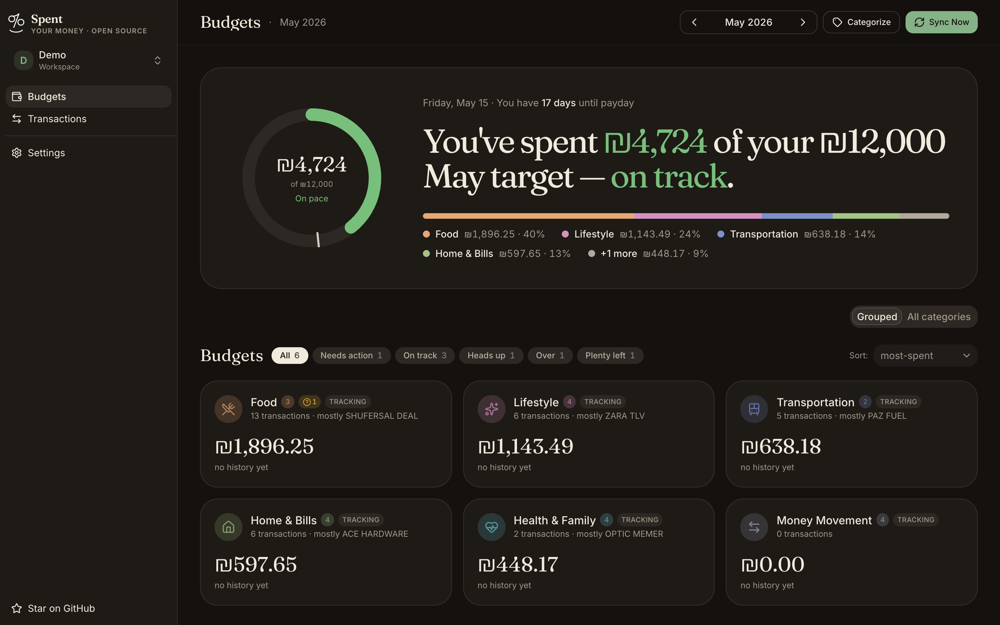
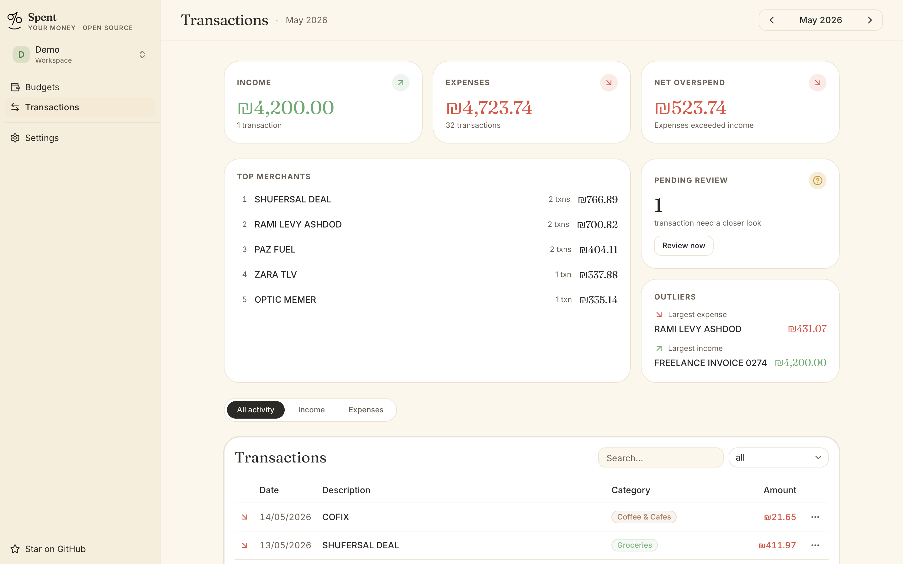
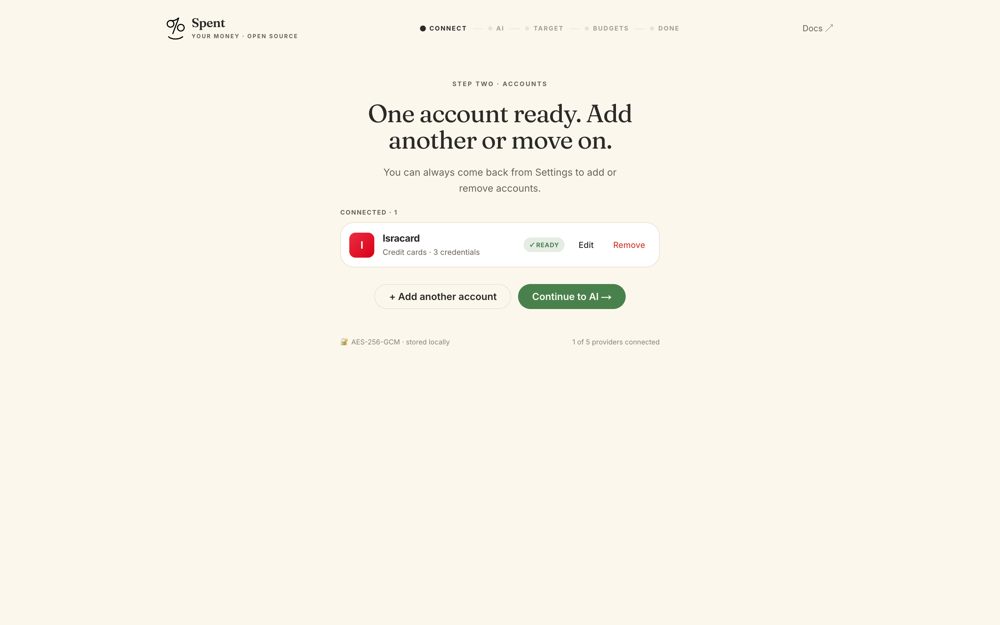
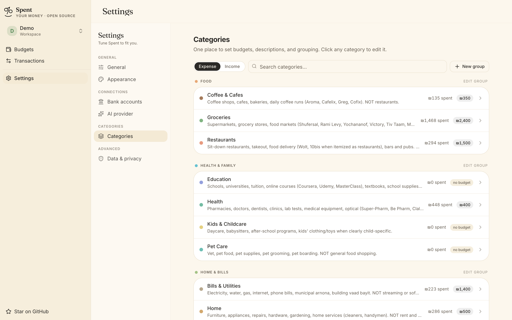
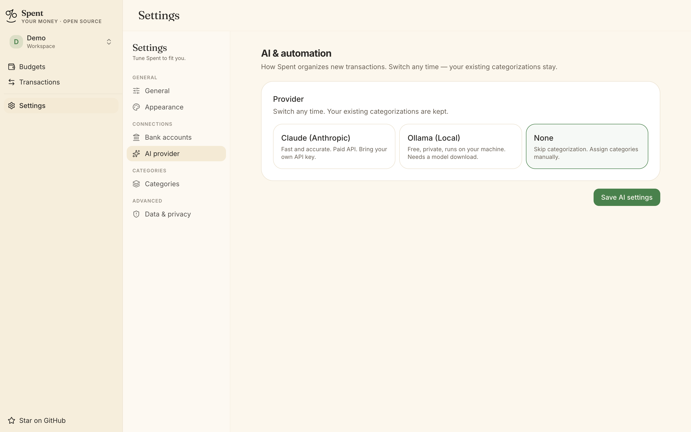
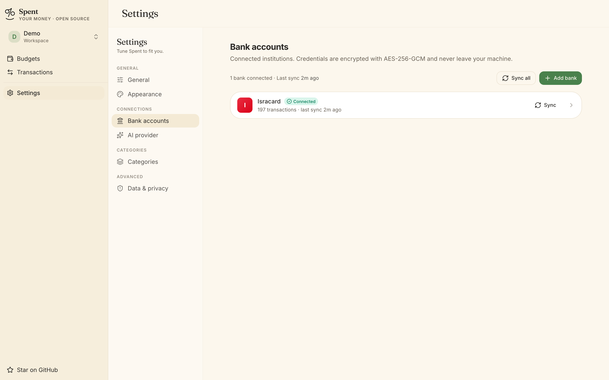
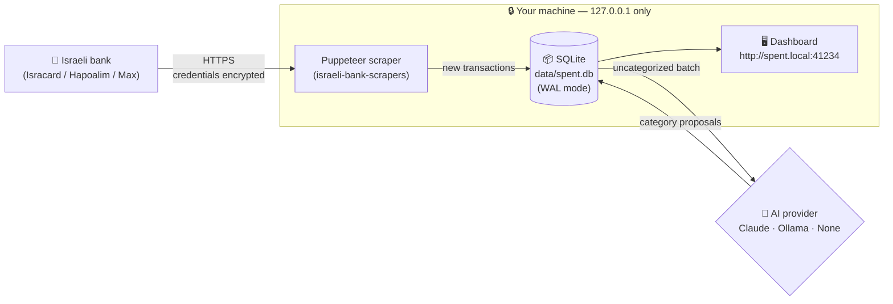

<div align="center">

<picture>
  <source media="(prefers-color-scheme: dark)" srcset="public/logo_darkmode.svg">
  
</picture>

# Spent

**Local-only personal finance for Israeli bank accounts.**
Encrypted. AI-categorized. Yours.

[](https://nextjs.org/)
[](https://react.dev/)
[](https://www.typescriptlang.org/)
[](https://sqlite.org/)
[](#license)
[](#features)

</div>

> [!WARNING]
> Personal, local-only tool. Scraping financial institutions may violate their Terms of Service. Use only for your own accounts on your own machine. **Do not deploy as a hosted service.**

<div align="center">



</div>

## Why Spent?

Israeli banks have terrible exports, YNAB doesn't speak ILS gracefully, and every "cloud finance" app wants you to hand over your bank password. Spent is the answer for people who'd rather just run something on their own laptop.

Your transactions get pulled directly from your bank with [`israeli-bank-scrapers`](https://github.com/eshaham/israeli-bank-scrapers), stored in a local SQLite file you can `cp` and back up like any other file, and categorized by an AI provider you choose: paid Claude, free local Ollama, or nothing at all.

The trade-off is honest: you self-host, you trust the scraper, and you accept that banks may not love automation. In return you get a fast, beautiful, fully offline dashboard that never phones home.

## Features

<table>
<tr>
<td width="33%" valign="top">

### 🏦 Israeli bank integration
Isracard, Bank Hapoalim, and Max work out of the box. Visa Cal and Bank Leumi are on the roadmap.

</td>
<td width="33%" valign="top">

### 🤖 AI categorization
Choose Claude (Anthropic) for best accuracy, Ollama for fully local LLMs, or skip and categorize manually.

</td>
<td width="33%" valign="top">

### 🔒 Local-only & encrypted
Credentials encrypted with AES-256-GCM. Server binds to `127.0.0.1` only — never reachable from your LAN or the internet.

</td>
</tr>
<tr>
<td valign="top">

### 📊 Budgets with pacing
Hierarchical categories, monthly targets, "ahead of pace" hero card, and per-category drilldown.

</td>
<td valign="top">

### 🌓 Light & dark theme
Polished buttercream-and-sage palette in light mode, warm charcoal in dark. System-aware by default.

</td>
<td valign="top">

### 🍎 Menu bar / tray app
Optional native companion lives in your menu bar (macOS) or notification area (Windows) — one click to open the dashboard or trigger a sync.

</td>
</tr>
<tr>
<td valign="top">

### 🎯 Auto-detected transfers
Credit card payments and inter-account moves are recognized and excluded from spending totals.

</td>
<td valign="top">

### 📅 Multi-month history
Pull up to 3 months of transactions per sync (configurable). Most banks support 12 months total.

</td>
<td valign="top">

### 🔍 Merchant memory
Once you correct an AI categorization, Spent remembers — same merchant goes to the right category next time.

</td>
</tr>
</table>

## Screenshots

<table>
<tr>
<td width="50%" align="center"><b>Dashboard — light</b></td>
<td width="50%" align="center"><b>Dashboard — dark</b></td>
</tr>
<tr>
<td></td>
<td></td>
</tr>
<tr>
<td align="center"><b>Transactions</b></td>
<td align="center"><b>Setup wizard</b></td>
</tr>
<tr>
<td></td>
<td></td>
</tr>
<tr>
<td align="center"><b>Categories</b></td>
<td align="center"><b>AI provider</b></td>
</tr>
<tr>
<td></td>
<td></td>
</tr>
<tr>
<td colspan="2" align="center"><b>Bank accounts</b></td>
</tr>
<tr>
<td colspan="2"></td>
</tr>
</table>

## How it works



Everything inside the dashed box stays on your laptop. The only outbound traffic is to your bank (for scraping) and optionally `api.anthropic.com` (if you chose Claude) or `localhost:11434` (if you chose Ollama).

## Supported banks

| Bank | Type | Status |
|---|---|---|
| **Isracard** | Credit card | ✅ Supported |
| **Bank Hapoalim** (incl. Poalim wallets) | Bank | ✅ Supported |
| **Max** (formerly Leumi Card) | Credit card | ✅ Supported |
| Visa Cal | Credit card | 🚧 Planned |
| Bank Leumi | Bank | 🚧 Planned |

Don't see your bank? Adding a scraper is a small wrapper around `israeli-bank-scrapers` — see [Contributing](#contributing).

## AI providers

| | **Claude** (Anthropic) | **Ollama** (local) | **None** |
|---|---|---|---|
| Cost | ~₪0.004 per sync | Free | Free |
| Accuracy | Best | Good (depends on model) | Manual |
| Network | `api.anthropic.com` | `localhost:11434` | Offline |
| Setup | API key | Install Ollama + pull a model | Nothing |

Default model when Claude is selected: `claude-haiku-4-5` (cheap, fast, accurate for categorization). For Ollama, `llama3.2:3b` is the recommended default.

You can change providers any time from **Settings → AI provider**. Existing categorizations are kept.

## Requirements

- **Node.js 22+**
- **macOS 13+**, **Ubuntu 22+** (with systemd), or **Windows 11**
- A bank account with **2FA disabled** (most Israeli banks require this for automation — OneZero is the exception)

## Install

```bash
git clone https://github.com/Shaya16/Spent.git
cd spent
npm install
npm run build
npm run service:install
```

`service:install` registers an auto-start unit (LaunchAgent on macOS / systemd on Linux / Task Scheduler on Windows) and adds `127.0.0.1 spent.local` to your hosts file. The hosts edit is the only step that asks for `sudo` / Administrator.

Open **`http://spent.local:41234`** and bookmark it.

**Menu bar / tray app (optional)** — native status icon with one-click open, sync, and start/stop. Pre-built binaries are attached to every [release](https://github.com/Shaya16/Spent/releases/latest), so no toolchain needed.

**macOS** (`Spent.app.zip`):
```bash
unzip Spent.app.zip -d ~/Applications/
xattr -dr com.apple.quarantine ~/Applications/Spent.app   # if Gatekeeper complains
open ~/Applications/Spent.app
```

**Windows** (`Spent.exe`):
```powershell
mkdir $env:LOCALAPPDATA\Programs\Spent
Move-Item .\Spent.exe $env:LOCALAPPDATA\Programs\Spent\
# SmartScreen on first launch: "More info" → "Run anyway"
# For auto-start: drop a shortcut to Spent.exe into shell:startup
```

First launch on either platform shows an unsigned-binary warning. That's expected for an open-source project without paid code-signing certificates.

## First-time setup

In the browser:

1. **Connect your bank** — credentials are AES-256-GCM encrypted before they touch disk.
2. **Choose an AI provider** — Claude (default), Ollama, or none.
3. **Set your monthly ceiling** — total spend you want to stay under each month.
4. **Set per-category budgets** — type an amount on any category to budget it; leave blank to track without a limit.
5. **Done.** Sync starts automatically: 3 months of transactions, then AI categorization.

## How you'll use it

| What you want | Run |
|---|---|
| Just use the app (no coding) | Open `http://spent.local:41234` |
| Code and see changes instantly | `npm run dev` → `http://127.0.0.1:3000` |
| Update the always-on app after editing | `npm run service:reload` |

Rare cases:

- Hacking on the menu bar app itself → see [Building the menubar from source](#building-the-menubar-from-source) under Contributing.
- Changed install scripts or hostname → `npm run service:uninstall && npm run service:install`.

## Service commands

| Command | What it does |
|---|---|
| `npm run service:status` | Running? Bound to loopback? |
| `npm run service:start` / `:stop` | Start/stop now |
| `npm run service:reload` | Rebuild and restart |
| `npm run service:logs` | Tail server logs |
| `npm run service:open` | Open the app in your browser |
| `npm run service:uninstall` | Remove auto-start and hosts entry. `data/` is untouched. |

## Security at a glance

| Concern | Defense |
|---|---|
| Credentials at rest | AES-256-GCM, encryption key file mode `0600` (server refuses to start otherwise) |
| Network exposure | Bound to `127.0.0.1` only — not reachable from your LAN or the internet |
| Browser CSRF | Origin / Referer validation on every mutation |
| Bot detection | Chromium sandbox on by default (`SPENT_DISABLE_CHROMIUM_SANDBOX=1` to opt out) |
| Bundle integrity | `israeli-bank-scrapers`, `better-sqlite3`, and `@anthropic-ai/sdk` pinned to exact versions |
| Browser hardening | Strict CSP, `X-Frame-Options: DENY`, `Permissions-Policy` locks down camera/mic/geo/payment |

**Turn on full-disk encryption** (FileVault / BitLocker / LUKS). The encryption key file sits next to the database, so disk-level protection is your last line of defense if the laptop is lost.

Full threat model and responsible-disclosure policy → [SECURITY.md](SECURITY.md).

## Where your data lives

- `data/spent.db` — transactions, categories, budgets, settings
- `data/.encryption-key` — 32-byte AES key, mode `0600`
- `~/Library/Logs/Spent/` (macOS) / `~/.local/state/spent/log/` (Linux) — service logs

Back up `data/` like any other folder. To migrate to a new machine, copy `data/` over and run `npm run service:install`.

## Architecture & code map

```
spent/
├── src/
│   ├── app/                  Next.js App Router (routes + API)
│   │   ├── (dashboard)/      Dashboard, transactions, settings pages
│   │   ├── api/              Sync (SSE), summary, transactions, setup
│   │   └── setup/            First-run wizard
│   ├── components/
│   │   ├── dashboard/        Hero card, category grid, budget drawer
│   │   ├── setup/            Bank, AI, target, budgets steps
│   │   └── settings/         Per-tab settings panels
│   ├── lib/                  Shared client-side types and helpers
│   └── server/
│       ├── ai/               Claude + Ollama provider implementations
│       ├── db/               SQLite singleton, migrations, query helpers
│       ├── lib/              Encryption, dedup, transfer detection, pace
│       └── scrapers/         Wrapper around israeli-bank-scrapers
├── menubar/                  Optional tray companions
│   ├── mac/                  Swift MenuBarExtra app
│   └── windows/              C# WPF NotifyIcon app
├── scripts/service/          LaunchAgent / systemd installer
└── data/                     SQLite + encryption key (gitignored)
```

## Troubleshooting

- **Port 41234 in use** → `lsof -nP -iTCP:41234 -sTCP:LISTEN` (Unix) or `netstat -ano | findstr :41234` (Windows). Kill the offender and re-run install.
- **Gatekeeper blocks `Spent.app`** → right-click → Open → Open. One-time.
- **Linux: "systemd user instance not available"** → `loginctl enable-linger $USER`.
- **Windows: hosts edit fails** → re-run install from an elevated PowerShell.
- **Bank scrape fails with "Cloudflare"** → temporarily run with `SPENT_DISABLE_CHROMIUM_SANDBOX=1` to let Puppeteer use a real Chrome profile.

## Roadmap

- [ ] Visa Cal scraper
- [ ] Bank Leumi scraper
- [ ] CSV / OFX export
- [ ] Custom user-defined categories
- [ ] Hebrew UI
- [ ] Mobile companion (Phase 2)
- [ ] Multiple workspaces in the menu bar / tray app

## Contributing

Spent is built for personal use first, open-source second. PRs welcome for:

- **New bank integrations** — add to `BANK_PROVIDERS` in [src/lib/types.ts](src/lib/types.ts), map to `CompanyTypes` in [src/server/scrapers/index.ts](src/server/scrapers/index.ts), flip `enabled: true`.
- **New AI providers** — implement the `AIProvider` interface from [src/server/ai/types.ts](src/server/ai/types.ts), register in [src/server/ai/factory.ts](src/server/ai/factory.ts), and add an option to the setup wizard.
- **UI polish, bug fixes, documentation.**

Conventions:

- TypeScript strict mode. No `any` without a comment.
- Conventional commits: `feat:`, `fix:`, `chore:`, `docs:`, `refactor:`.
- Comments only where the "why" isn't obvious. No em dashes in code, commits, or docs.

### Building the menubar from source

End users should grab the prebuilt binaries from [Releases](https://github.com/Shaya16/Spent/releases/latest). Local builds are only needed when you're changing the menubar app itself:

```bash
# macOS: needs Xcode Command Line Tools (xcode-select --install)
npm run menubar:install                  # builds + copies to ~/Applications/

# Windows: needs .NET 8 SDK (winget install Microsoft.DotNet.SDK.8)
npm run menubar:build:windows
Copy-Item menubar\windows\build\Spent.exe $env:LOCALAPPDATA\Programs\Spent\
```

Release artifacts are built by [.github/workflows/release.yml](.github/workflows/release.yml) on every `v*` tag push, or on demand via Actions tab → release → Run workflow (you type the tag name in the input field).

## License

MIT

## Acknowledgments

Built on the shoulders of:

- [`israeli-bank-scrapers`](https://github.com/eshaham/israeli-bank-scrapers) — the heart of every bank integration
- [Next.js 16](https://nextjs.org/) and [React 19](https://react.dev/)
- [`shadcn/ui`](https://ui.shadcn.com/) on top of [`base-ui`](https://base-ui.com/)
- [`better-sqlite3`](https://github.com/WiseLibs/better-sqlite3)
- [Anthropic Claude](https://www.anthropic.com/) and the local-LLM crew at [Ollama](https://ollama.com/)
